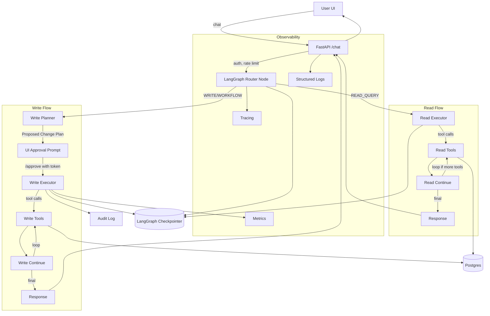

# Architecture Diagram – Text Description

## Components
- **UI**: Web chat client (frontend) capturing user input, rendering approval prompts, and showing tool outputs.  
- **API Gateway / FastAPI**: `/chat`, `/approve`, health endpoints; handles auth, CORS, rate limits, request IDs.  
- **Agent Service (LangGraph runtime)**: Runs the StateGraph, intent routing, planning, tool execution, and approval interruption.  
- **LangGraph Checkpointer**: SQLite (persistent) with MemorySaver fallback; stores `AgentState` per conversation.  
- **Tools Layer**: Read tools (`get_projects`, `get_tasks`, `get_team_members`, `get_financial_data`), write tools (`create_project`, `create_task`, `update_project`, `update_task`), future external connectors.  
- **Datastore**: Postgres for Projects/Tasks/TeamMembers; optional object store for audit logs.  
- **Audit Log Sink**: Append-only log for approvals and writes.  
- **Eval Harness**: Golden conversations, mocked tools, replay runner.  
- **Observability Stack**: Structured logging, metrics, and tracing (OpenTelemetry exporters to backend).

## Data flows
- **Read path**: UI → API `/chat` → Agent router → read_executor → read_tools (SQLAlchemy reads) → read_continue → response → UI. Trust boundary at API (auth + rate limit).  
- **Write with approval**: UI → API `/chat` → router → write_planner → Proposed Change Plan → UI approval modal → API `/approve` sets `approved` + `approval_token` → agent resumes at write_executor → write_tools mutate DB → audit log → response → UI. Approval enforced at interrupt_before `write_executor`.  
- **Workflow**: UI → API → router intent=WORKFLOW → write_planner builds multi-step plan → approval → write_executor executes steps with retries → checkpoint after each step → audit log + response → UI. Trust boundary same as write path.

## Mermaid diagram

